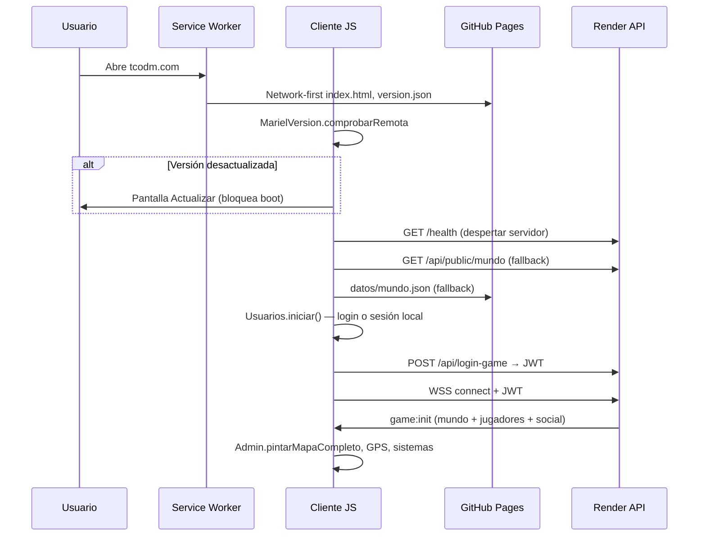
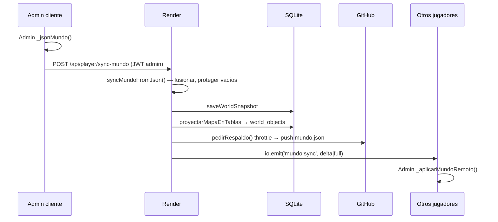
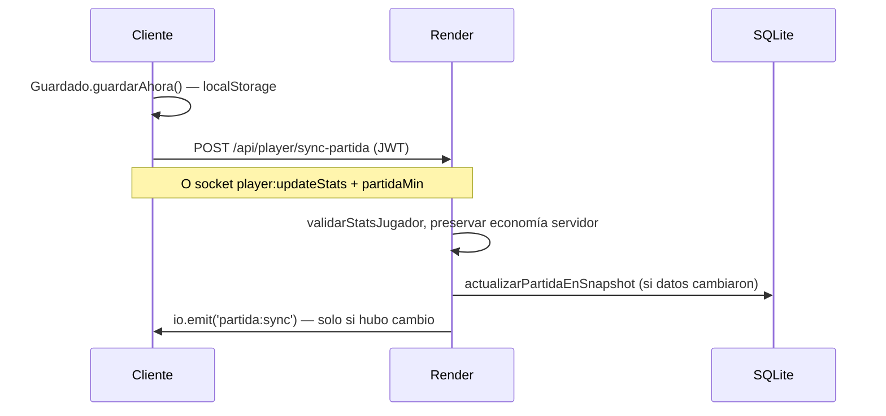
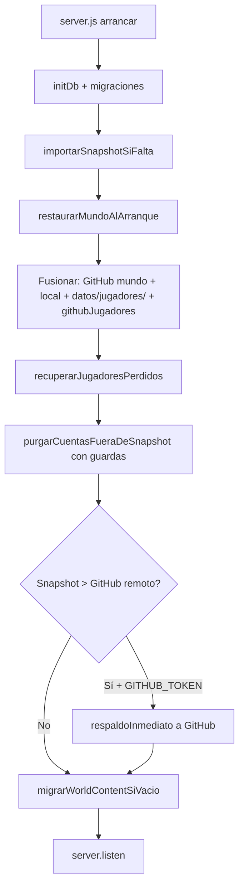

# ESTADO DEL PROYECTO — Kingdom Map / Mariel Online

**Documento técnico completo para revisión externa (ChatGPT / equipo)**  
**Generado:** 9 de julio de 2026  
**Versión del juego:** v316 (documento base v315; fixes socket en v316)  
**Repositorio:** https://github.com/randyraulbr1/github-pages  
**Cliente en producción:** https://tcodm.com (GitHub Pages, rama `main`)  
**Servidor en producción:** https://mariel-online.onrender.com (Render Starter, carpeta `server/`)  
**Último merge en main:** PR #140 — `feat(v315): logs sync visibles + reconexión loadWorld + mundo:sync temprano`  
**Commit:** `1702b90af`

---

## Índice

1. [Resumen ejecutivo](#1-resumen-ejecutivo)
2. [Qué hace el juego actualmente](#2-qué-hace-el-juego-actualmente)
3. [Arquitectura general](#3-arquitectura-general)
4. [Diagrama de flujo de datos](#4-diagrama-de-flujo-de-datos)
5. [Despliegue e infraestructura](#5-despliegue-e-infraestructura)
6. [Sistemas completos — funcionamiento interno](#6-sistemas-completos--funcionamiento-interno)
7. [API REST completa](#7-api-rest-completa)
8. [Socket.IO — eventos completos](#8-socketio--eventos-completos)
9. [Base de datos SQLite](#9-base-de-datos-sqlite)
10. [Estructura de datos mundo.json](#10-estructura-de-datos-mundojson)
11. [Cliente — módulos y funciones](#11-cliente--módulos-y-funciones)
12. [Servidor — módulos y funciones](#12-servidor--módulos-y-funciones)
13. [Archivos del proyecto](#13-archivos-del-proyecto)
14. [Archivos nuevos y modificados (historial reciente)](#14-archivos-nuevos-y-modificados-historial-reciente)
15. [Fases del plan maestro (faces.md)](#15-fases-del-plan-maestro-facesmd)
16. [Qué funciona correctamente](#16-qué-funciona-correctamente)
17. [Qué tiene errores](#17-qué-tiene-errores)
18. [Qué está incompleto](#18-qué-está-incompleto)
19. [Qué falta por hacer](#19-qué-falta-por-hacer)
20. [Bugs conocidos](#20-bugs-conocidos)
21. [Próximos pasos recomendados](#21-próximos-pasos-recomendados)
22. [Variables de entorno](#22-variables-de-entorno)
23. [Reglas del proyecto](#23-reglas-del-proyecto)

---

## 1. Resumen ejecutivo

Kingdom Map (Mariel Online) es un **RPG GPS multijugador** ambientado en Mariel, Artemisa, Cuba. Los jugadores se mueven por un mapa real (Leaflet + tiles CartoCDN), interactúan con NPCs, enemigos, tiendas, cofres, tesoros y misiones, y se ven entre sí en tiempo real.

**Arquitectura híbrida:**

| Capa | Tecnología | Rol |
|------|------------|-----|
| Cliente PWA | HTML/CSS/JS vanilla, Leaflet, Service Worker | UI, mapa, localStorage, panel admin in-game |
| Servidor vivo | Node.js + Express + Socket.IO + SQLite | Autoridad: combate, economía, cuentas, mundo |
| Respaldo persistente | GitHub (`datos/mundo.json`, `datos/jugadores/`) | Sobrevive redeploys de Render; no es tiempo real |

**Regla de oro:** el cliente pide; el servidor decide. El inventario, vida, dinero y objetos del mapa no se confían al cliente.

**Estado general (jul 2026):** el juego es jugable en PC y parcialmente validado en móvil. Las fases 1, 4, 5.1, 6, 7, 9–13 y 15B están completadas en código. Fases 2, 3, 5, 8 y 16 siguen en progreso. El punto más débil sigue siendo la **sincronización dual Render ↔ GitHub** y la **validación móvil real** (Fase 8, pendiente de Randy).

---

## 2. Qué hace el juego actualmente

### 2.1 Jugador normal

- **Registro e inicio de sesión** con nombre, teléfono (opcional) y PIN de 4 dígitos.
- **Mapa GPS** centrado en Mariel con límites jugables configurables.
- **Pin del jugador** en el mapa: posición real (GPS) o simulada; zoom de seguimiento.
- **Vida, hambre, XP y nivel** con barras HUD; desgaste de hambre periódico; daño por hambre a 0.
- **Inventario (mochila)** de 25 slots con drag-and-drop, apilado, equipo (arma + piezas T1–T4), cocinar con cuchillo.
- **Dinero** y historial de transacciones.
- **Tiendas NPC** — comprar y vender (servidor autoritativo vía socket).
- **Cofres** en el mapa con PIN y contenido.
- **Tesoros** con detector de proximidad y recogida compartida.
- **Objetos del mapa** (árboles, recursos) con recogida compartida.
- **Misiones** con recompensas y overlay HUD.
- **Pesca** minijuego.
- **Correo** in-game.
- **Enemigos** con IA servidor (movimiento, ataque, visión por zonas), combate por proximidad, botín compartido proporcional.
- **Muerte y revivir** — cuerpo ⚰️ en mapa 1 h; revivir por amigo (≤55 m) o admin; protección 2 min post-revivir.
- **Bolsas drop** — al eliminar items del inventario caen al suelo (5 min TTL).
- **Multijugador en vivo** — ver otros jugadores cercanos (500 m), movimiento, stats, cuerpos.
- **Amigos** — solicitudes, aceptar/rechazar, bloqueo, marcador en mapa, línea hacia amigo marcado.
- **Chat privado** — texto y ubicación en mapa; historial; lecturas.
- **Notificaciones / avisos** agrupados con toast +N.
- **Opciones** — perfil, preferencias HUD, cerrar sesión.
- **Pantalla de actualización forzada** cuando la versión remota > local.
- **Indicador de conexión** (wifi/sync) en HUD.
- **Service Worker** — caché offline de assets; network-first para `index.html` y `version.json`.

### 2.2 Administrador (randy / SoyCaos)

- **Panel ADM in-game** (botón 🛠️) reorganizado en 3 grupos: Mundo / Combate / Sistema.
- **Colocar** misiones, tesoros, objetos, enemigos, tiendas en el mapa.
- **Organizar** — arrastrar pins existentes; zona de basura para borrar.
- **Guardar mapa / Publicar mundo** → servidor + broadcast `mundo:sync` a todos.
- **Editor de jugadores** — stats, mochila, contraseña, ban, revivir.
- **Crear cuentas** desde admin.
- **Mantenimiento** — bloquear acceso con mensaje.
- **Mensajes globales** a jugadores.
- **Catálogo de objetos** — CRUD de items del juego.
- **Config combate** — fórmulas jugador/enemigo por nivel.
- **Depuración** — métricas en vivo, ping, sync status, export TXT.
- **Historial admin** — acciones con restauración.
- **Respaldo GitHub** manual y automático (throttle 10 min).
- **Logs sync visibles** (`#mariel-sync-log`) — TOKEN, PUBLICANDO, SOCKET, mundo:sync.
- **Optimización visibilidad** 500 m toggle.
- **Mover pin de jugador** (admin teleport).

### 2.3 Lo que NO hace (aún)

- No hay app nativa iOS/Android (solo PWA web).
- No hay matchmaking ni salas.
- No hay voz/video.
- No hay economía real / pagos.
- Oracle Cloud (Fase 15) pausada — producción sigue en Render.
- `mariel-explorer/` es copia local de desarrollo — **no tocar ni commitear**.

---

## 3. Arquitectura general

```
┌─────────────────────────────────────────────────────────────────────────────┐
│                         CLIENTE (tcodm.com / GitHub Pages)                   │
│  index.html → 50+ scripts JS → Leaflet mapa → localStorage partidas       │
│  Service Worker (sw.js v315) → caché assets + tiles mapa                  │
└───────────────────────────────┬─────────────────────────────────────────────┘
                                │
                    HTTPS REST  │  WSS Socket.IO
                    JWT Bearer  │  auth.token
                                ▼
┌─────────────────────────────────────────────────────────────────────────────┐
│              SERVIDOR (mariel-online.onrender.com / Node.js)                 │
│  Express → /api/* REST                                                       │
│  Socket.IO → multijugador, combate, chat, sync tiempo real                   │
│  SQLite (game.sqlite) → users, players, world_snapshot, world_content, chat  │
│  enemyAI.js tick 500ms → movimiento/ataque enemigos                          │
│  interest.js → solo jugadores ≤500m reciben updates de movimiento            │
└───────────────────────────────┬─────────────────────────────────────────────┘
                                │
                    push/pull   │  GITHUB_TOKEN
                                ▼
┌─────────────────────────────────────────────────────────────────────────────┐
│                    GITHUB (randyraulbr1/github-pages, main)                  │
│  datos/mundo.json — snapshot global (mapa + jugadores + partidas)           │
│  datos/jugadores/indice.json + {perfilId}.json — respaldo por cuenta          │
│  Cliente estático (index.html, js/, css/) → GitHub Pages → tcodm.com          │
└─────────────────────────────────────────────────────────────────────────────┘
```

### Principios

1. **Servidor = autoridad en vivo.** SQLite + sockets deciden el estado actual.
2. **GitHub = disco permanente.** Tras redeploy Render, el boot fusiona GitHub + local + carpeta jugadores.
3. **Cliente = vista + intención.** Envía movimientos, ataques, compras; nunca inventario crudo.
4. **Una sesión por cuenta.** Token de sesión en snapshot; login en otro dispositivo expulsa al anterior.

---

## 4. Diagrama de flujo de datos

### 4.1 Arranque del cliente



### 4.2 Admin publica el mundo



### 4.3 Sync de partida del jugador



### 4.4 Boot del servidor (post-redeploy Render)



### 4.5 Flujo ASCII simplificado

```
[Jugador] ──login──► [Render /api/login-game] ──JWT──► [localStorage]
[Jugador] ──socket──► [Render Socket.IO] ◄──game:init── [Estado vivo]
[Admin] ──sync-mundo──► [Render] ──save──► [SQLite] ──push──► [GitHub mundo.json]
[Render redeploy] ──boot──► [Lee GitHub + local] ──► [SQLite repoblado]
[Cliente sin socket] ──poll──► [GET /api/public/mundo cada 6s]
```

---

## 5. Despliegue e infraestructura

| Componente | URL / ubicación | Notas |
|------------|-----------------|-------|
| Frontend PWA | https://tcodm.com | GitHub Pages desde rama `main` |
| Backend API | https://mariel-online.onrender.com | Render Starter ~$7/mes, sin sleep |
| Health check | GET `/health` | `{ ok, service, time }` |
| Repo GitHub | randyraulbr1/github-pages | Rama `main` datos + código |
| Rama deploy histórica | `claude/web-rpg-gps-game-n3ybow` | Usada antes; main es canónica |
| Base de datos | `server/data/game.sqlite` | Efímera en Render — depende de GitHub backup |
| Versión | `version.json` + `CONFIG.version` | Actual: **315** |

### Cache busting (index.html)

| Versión query | Archivos |
|---------------|----------|
| v315 | estilos.css, sync_log.js, sync_servidor.js, admin.js, multijugador.js |
| v314 | config.js, sw.js |
| v313 | version_app.js, diagnostico_red.js, principal.js |
| v312 | admin_depuracion.js, mochila.js |
| v311 | red.js, utilidades.js, consumo_red.js, usuarios.js, guardado.js |
| v298 | ui_components.js, ui_manager.js |
| v295 | chat, amigos, enemigos, opciones, etc. |
| v104 | mapa, tiendas, misiones, leaflet, etc. |

**Nota:** algunos assets tienen versiones de query desalineadas (v104 vs v315). El meta `mariel-version=315` y SW `mariel-explorer-v315` son la referencia canónica.

---

## 6. Sistemas completos — funcionamiento interno

### 6.1 Login y cuentas

**Archivos:** `js/usuarios/usuarios.js`, `server/routes/authRoutes.js`, `server/auth.js`, `server/syncCuentas.js`

**Flujo registro:**
1. Cliente valida nombre (3–20 chars), PIN 4 dígitos, teléfono opcional.
2. `POST /api/register` — rate limit 8/h por IP.
3. Servidor: rechaza nombres admin reservados (`randy`, `SoyCaos`).
4. Crea `users` + `players` en SQLite con `role=jugador`.
5. Añade entrada en `world_snapshot.jugadores[]` y partida vacía.
6. `respaldarCuentasEnGitHubInmediato()` si hay token.
7. Devuelve JWT (`signPlayerToken`).

**Flujo login (`/api/login-game`):**
1. Busca por nombre en SQLite y/o snapshot.
2. Verifica PIN: bcrypt `password_hash` o legacy `pinHash` SHA-256 del snapshot.
3. Migra `pinHash` → bcrypt en primer login exitoso.
4. Genera `sesionToken` en snapshot; emite `sesion:actualizada` para expulsar otras sesiones.
5. JWT con `role` normalizado (`jugador`, `admin`, `owner`, etc.).

**Sesión local cliente:**
- `localStorage.mariel_perfiles_v2` — lista de perfiles.
- `localStorage.mariel_online_token` — JWT actual.
- `Usuarios.iniciarVigilanciaSesion()` — escucha `sesion:actualizada` y `account:deleted`.

**Roles (v308+):**
- `jugador` (default), `tester`, `moderador`, `admin`, `owner`
- `POST /api/set-role` — solo `owner` puede cambiar roles.
- Admin legacy: nombres `randy` y `SoyCaos` siguen teniendo permisos vía `isGameAdminAuth`.

### 6.2 Multijugador y Socket.IO

**Archivos:** `js/online/multijugador.js`, `server/sockets.js`, `server/interest.js`

**Conexión:**
1. `Multijugador.conectar()` — `despertarServidor()` solo `/health` (no bloquea 45s).
2. Carga Socket.IO desde `lib/socket.io/` o CDN fallback.
3. `io(url, { auth: { token: JWT } })`.
4. Timeout conexión: 28s (`conectarYEsperarMundo`).
5. Al conectar: recibe `game:init` con jugadores cercanos, objetos, misiones, mundo, social.

**Movimiento:**
- Cliente: `GPS` → `Multijugador.enviarPosicion(lat, lng)` → socket `player:move`.
- Servidor: valida delta (anti-teleport), rate limit 100/min.
- Broadcast: solo jugadores dentro de 500m (`interest.js`), coalesce 450ms / 4m.

**Stats:**
- `Multijugador.enviarStats()` → `player:updateStats` con `partidaMin`, `statsT`.
- Servidor acota HP/hambre/XP (`playerStats.js`); fusiona partida en snapshot.

**Reconexión (v315):**
- `loadWorld()` en evento `reconnect`.
- `mundo:sync` temprano (antes de `Admin.iniciar`) → cola en `_mundoPendiente` → `aplicarMundoPendiente()`.

**Jugadores en mapa:**
- Marcadores Leaflet con emoji/icono; barra de vida unificada.
- Cuerpos muertos ⚰️ con popup saqueo/revivir.
- Optimización: ocultar entidades >500m si `optimizarVisibilidad` activo.

### 6.3 Sincronización mundo (Render ↔ GitHub ↔ Cliente)

**Archivos:** `js/online/sync_servidor.js`, `server/syncMundo.js`, `server/mundoDelta.js`, `server/githubMundo.js`, `server/githubJugadores.js`, `server/importSnapshot.js`, `js/nucleo/sync_log.js`

**Publicación admin:**
1. `Admin.publicarMundo()` construye JSON vía `_jsonMundo()`.
2. Preferencia: `SyncServidor.sincronizarMapaDelta()` — upserts/deletes por entidad.
3. Fallback: `SyncServidor.publicar()` — POST completo `/api/player/sync-mundo`.
4. Servidor `syncMundoFromJson()`:
   - Protege `jugadores:[]` vacío (no borra cuentas).
   - Protege arrays de mapa vacíos (no borra mundo por caché vacío).
   - `fusionarJugadoresPublicacion`, `fusionarMapaPublicacion`.
   - `proyectarMapaEnTablas` → `world_objects` + `missions`.
   - `saveWorldSnapshot` en SQLite.
   - `emitirMundoSync` — delta o full vía `mundoDelta.js`.
   - `pedirRespaldo()` → GitHub (throttle 10 min).

**Boot servidor (v314):**
- `restaurarMundoAlArranque()` fusiona 4 fuentes:
  1. GitHub `datos/mundo.json`
  2. Local `datos/mundo.json`
  3. Carpeta `datos/jugadores/*.json`
  4. `githubJugadores.fetchJugadoresDesdeGitHub()`
- Auto-saneo: si snapshot local > remoto GitHub → push inmediato.

**Cliente lectura inicial:**
1. `MundoPublico.descargar()` — Render `/api/public/mundo`.
2. Fallback: `datos/mundo.json` en GitHub Pages.
3. Dev fallback: raw.githubusercontent.com (solo desarrollo).

**Logs diagnóstico (v315):**
- Cliente `MarielSyncLog`: TOKEN, PUBLICANDO, RESPUESTA, SOCKET, RECIBIDO mundo:sync, APLICANDO.
- Panel `#mariel-sync-log` visible solo admin.
- Servidor: logs en sync-mundo, SQLite save, io.emit.

### 6.4 Inventario y economía

**Archivos:** `js/mochila/mochila.js`, `server/playerInventory.js`, `server/playerEconomy.js`, `js/bolsas/bolsas.js`

- **25 slots** mochila; equipo en `_equipoT` (persiste v310+).
- Servidor rechaza `player:updateInventory` — inventario solo vía acciones (compra, loot, etc.).
- `preservarEconomiaServidor` en sync-partida: no sobrescribe `mochila`, `dinero` desde cliente sin validación.
- Tienda: `player:shopBuy` / `player:shopSell` — valida distancia, stock, saldo.
- Cocinar: `player:cookItem` — requiere cuchillo en mochila.
- Bolsas drop: `world:dropBag` / `world:pickupBag` — TTL 5 min.
- Cuerpos muertos: inventario visible 1h; saqueo por proximidad.

### 6.5 Combate y enemigos

**Archivos:** `js/enemigos/enemigos.js`, `js/enemigos/botin_enemigo.js`, `server/enemyAI.js`, `server/syncMundo.js` (ataque/botín)

**IA servidor (`enemyAI.js`):**
- Tick cada 500ms.
- Estados: patrulla, persecución, ataque.
- Emite `world:updateObject`, `enemy:attack`, `player:updateStats`.

**Combate jugador:**
- `world:attackEnemy` — valida zona, calcula daño servidor (`danoJugadorVsEnemigo`).
- Daño proporcional al nivel; probabilidad de fallo por diferencia de nivel.
- Al morir enemigo: `crearBotinEnemigo` — loot proporcional al daño infligido.
- `world:claimEnemyLoot` — reclamar con validación proximidad.

**Cliente:**
- HUD combate con barra vida enemigo.
- Huir, invisibilidad temporal post-ataque.
- `BotinEnemigo` — overlay loot compartido.

### 6.6 Chat y amigos

**Archivos:** `js/chat/chat.js`, `js/online/amigos.js`, `server/routes/chatRoutes.js`, `server/routes/friendRoutes.js`

**Amigos:**
- REST: `/api/friends/*` — request, accept, reject, block.
- Socket: `friends:refresh`, eventos `friends:request`, `friends:accepted`, `friends:update`.
- UI: carpeta expandible, popup en mapa, marcar destino.

**Chat:**
- REST: `/api/chat/conversations`, `/:playerId`, `/send`, `/read`.
- Socket: `chat:send`, `chat:history`, `chat:markRead`, `chat:message`, `chat:read`.
- Rate limit: 30 msg/min.
- Bloqueo: `canChatBetween` verifica blocks.
- Envío ubicación: pin en mapa desde chat.

### 6.7 Panel administrador

**Archivos:** `js/admin/admin.js` (~6700 líneas), `js/admin/admin_depuracion.js`, `js/admin/catalogo_objetos.js`

**Navegación (v311):**
- Raíz: Mundo | Combate | Sistema (`Admin._MENU_ADMIN`).
- `_iniciarNavAdmin()` — `_bindAdminBtn` con `function()` para `.call(this)`.
- Fix v312: cache buster `admin.js?v=312+` — antes cargaba JS viejo sin nav.

**Modos mapa:**
- `colocar` — nuevo entity tras formulario.
- `organizar` — drag pins; fix z-index v299.

**Publicar:**
- Botón Guardar mapa → `_syncMapaServidor()` → delta o full.
- Confirmación si publicación reduciría entidades >umbral.

**Depuración (v310):**
- Sin parpadeo; export TXT.
- Métricas: ping, jugadores online, objetos, sync status, consumo red.

### 6.8 Guardado local y nube

**Archivos:** `js/guardado/guardado.js`, `js/mundo/mundo_publico.js`

- Clave: `mariel_explorer_v1_{perfilId}` en localStorage.
- Debounce guardado; sync nube cada 90s.
- `statsT`, `nubeT` para merge conflictos — cliente prioriza timestamp más reciente.
- Servidor no emite `partida:sync` si datos JSON iguales (anti-parpadeo).

### 6.9 Service Worker y actualizaciones

**Archivos:** `sw.js`, `js/nucleo/version_app.js`, `js/nucleo/red.js`

- Pre-cache ~55 assets en install.
- Network-first: index.html, version.json, config.js.
- Cache-first: resto assets; tiles CartoCDN en bucket `-mapa`.
- `MarielVersion` compara local vs remoto; bloquea boot si desactualizado.
- Mensaje `skip-waiting` para activar nuevo SW.

### 6.10 UI Manager y capas

**Archivos:** `js/nucleo/ui_manager.js`, `js/nucleo/ui_components.js`, `css/estilos.css`

- Stack de ventanas; ESC cierra superior.
- `body.ui-bloquea-mapa` cuando hay panel abierto.
- Z-index: confirmaciones `--z-critico` / `--z-confirmaciones: 16000`.
- Componentes: UIPanel, UIButton, UIToast, UIDialog, UIProgressBar, UIGrid.

### 6.11 Rate limiting y anti-spam

**Archivo:** `server/rateLimit.js`

| Acción | Límite |
|--------|--------|
| Chat | 30/min |
| Amigos refresh | 15/min |
| Solicitud amistad | 12/min |
| Registro | 8/h por IP |
| Movimiento | 100/min |
| Admin mapa | 250/min |
| Publicar mundo | 15/min |

### 6.12 Historial y auditoría admin

**Archivos:** `server/adminHistorial.js`, `server/auditLog.js`, `server/eventLog.js`

- Historial: upsert/delete/config/publicar en `world_content` + JSONL.
- API restaurar versión anterior.
- Auditoría: `admin_partida_edit` cuando admin edita partida ajena.

### 6.13 Respaldo GitHub

**Archivos:** `server/githubMundo.js`, `server/respaldoThrottle.js`, `server/jugadoresBackup.js`, `server/backupDiario.js`

- Throttle: máximo 1 push cada 10 min (`pedirRespaldo`).
- Inmediato: registro, login migración, force-git-sync, auto-saneo boot.
- `prepararPayloadMundo` — serializa snapshot para commit.
- Backup diario programado.

---

## 7. API REST completa

### 7.1 Rutas directas (server.js)

| Método | Ruta | Auth | Descripción |
|--------|------|------|-------------|
| GET | `/admin` | — | Redirect 302 a tcodm.com |
| GET | `/` | — | client/index.html |
| GET | `/online` | — | online/index.html |
| GET | `/health` | — | Health check |
| GET | `/client/*`, `/lib/*` | — | Assets estáticos |

### 7.2 /api (authRoutes.js)

| Método | Ruta | Auth | Descripción |
|--------|------|------|-------------|
| GET | `/public/version` | — | Versión desde version.json |
| GET | `/public/mundo` | — | Snapshot público mundo |
| GET | `/public/cuentas` | — | Lista jugadores para login |
| GET | `/public/mundo/version` | — | Poll ligero actualizadoEn + count |
| GET | `/public/buscar-cuenta?q=` | — | Buscar cuenta |
| GET | `/debug/world` | — | Debug hash/counts (sin auth — riesgo) |
| POST | `/public/import-jugadores` | x-import-key | Import forzado mundo.json → SQLite |
| POST | `/login-game` | — | Login unificado juego |
| POST | `/register` | — | Registro nueva cuenta |
| POST | `/login` | — | Login bcrypt estándar |
| POST | `/set-role` | Owner JWT | Asignar role usuario |

### 7.3 /api/player (playerRoutes.js)

| Método | Ruta | Auth | Descripción |
|--------|------|------|-------------|
| GET | `/me` | JWT | Perfil actual + misiones |
| POST | `/sync-mundo` | Admin | Publicar mundo completo |
| POST | `/world/upsert` | Admin | Upsert objeto mapa |
| POST | `/world/delete` | Admin | Tombstone objeto |
| POST | `/world/config` | Admin | Config global mundo |
| GET | `/mundo` | JWT | Snapshot autenticado |
| POST | `/sync-partida` | JWT + Partida | Guardar partida PWA |
| POST | `/registrar-cuenta` | JWT | Registrar/actualizar perfil snapshot |
| POST | `/limpiar-cuentas` | Admin | Purga cuentas excepto admin |
| POST | `/restaurar-cuenta` | Admin | Restaurar cuenta eliminada |
| POST | `/force-git-sync` | Admin | Push forzado a GitHub |
| GET | `/admin-historial` | Admin | Últimas 50 acciones |
| POST | `/admin-historial/restore` | Admin | Restaurar desde historial |
| GET | `/sync-status` | Admin | Estado sync GitHub |

### 7.4 /api/world (worldRoutes.js)

| Método | Ruta | Auth | Descripción |
|--------|------|------|-------------|
| GET | `/objects` | — | Todos world_objects activos |
| GET | `/missions` | — | Misiones activas |

### 7.5 /api/friends (friendRoutes.js)

| Método | Ruta | Auth | Descripción |
|--------|------|------|-------------|
| GET | `/` | JWT | Amigos, pendientes, bloqueos |
| POST | `/request` | JWT | Enviar solicitud |
| POST | `/accept` | JWT | Aceptar |
| POST | `/reject` | JWT | Rechazar |
| DELETE | `/:playerId` | JWT | Eliminar amistad |
| POST | `/block` | JWT | Bloquear |
| DELETE | `/block/:playerId` | JWT | Desbloquear |

### 7.6 /api/chat (chatRoutes.js)

| Método | Ruta | Auth | Descripción |
|--------|------|------|-------------|
| GET | `/conversations` | JWT | Lista conversaciones |
| GET | `/:playerId` | JWT | Historial (max 120) |
| POST | `/send` | JWT | Enviar mensaje |
| POST | `/read` | JWT | Marcar leído |

---

## 8. Socket.IO — eventos completos

### 8.1 Autenticación conexión

- Token en `handshake.auth.token` o `query.token`.
- Verificación JWT; **BUG:** middleware acepta solo `role === 'player' || 'admin'` pero JWT firma `jugador` (ver sección 17).

### 8.2 Cliente → Servidor

| Evento | Auth extra | Descripción |
|--------|------------|-------------|
| `player:move` | rate limit | Posición GPS |
| `player:updateStats` | — | HP/hambre/XP + partidaMin |
| `admin:revivePlayer` | game admin | Revivir jugador |
| `admin:updatePlayerPartida` | game admin | Editar partida |
| `admin:movePlayerPin` | game admin | Teleport |
| `world:adminUpsert` | game admin | Upsert mapa |
| `world:adminDelete` | game admin | Delete mapa |
| `world:adminConfig` | game admin | Config mundo |
| `player:revive` | proximidad ≤55m | Revivir amigo |
| `player:updateInventory` | — | **RECHAZADO** |
| `world:cutTree` | proximidad | Cortar árbol |
| `world:pickupShared` | — | Recoger objeto compartido |
| `world:dropBag` | proximidad | Soltar bolsa |
| `world:attackEnemy` | zona | Atacar enemigo |
| `world:claimEnemyLoot` | proximidad | Reclamar botín |
| `world:pickupBag` | proximidad | Recoger bolsa |
| `world:tesoroRecogido` | — | Tesoro recogido |
| `player:shopBuy` | — | Comprar tienda |
| `player:shopSell` | — | Vender tienda |
| `player:useItem` | — | Usar consumible |
| `player:cookItem` | — | Cocinar |
| `player:lootBody` | proximidad | Saquear cuerpo |
| `world:pickup` | proximidad | Pickup legacy |
| `mission:complete` | — | Completar misión |
| `friends:refresh` | rate limit | Refrescar social |
| `chat:history` | block check | Historial DM |
| `chat:send` | rate limit | Enviar DM |
| `chat:markRead` | block check | Marcar leído |
| `disconnect` | — | Cleanup |

### 8.3 Servidor → Cliente

| Evento | Alcance | Descripción |
|--------|---------|-------------|
| `game:init` | socket | Estado inicial completo |
| `player:online` | cercanos | Jugador conectó |
| `player:offline` | cercanos | Jugador desconectó |
| `player:move` | cercanos | Movimiento |
| `player:updateStats` | cercanos/broadcast | Stats actualizados |
| `player:revived` | todos | Revivido |
| `player:adminMove` | room target | Teleport admin |
| `player:lootUpdate` | todos | Loot cuerpo cambió |
| `player:updateInventory` | self | Legacy pickup |
| `players:sync` | per viewer 12s | Lista cercanos |
| `partida:sync` | todos | Partida PWA |
| `sesion:actualizada` | todos | Nueva sesión |
| `account:deleted` | room target | Cuenta purgada |
| `cuerpos:sync` | todos | Cuerpos muertos |
| `world:updateObject` | todos/cercanos | Objeto actualizado |
| `world:removeObject` | todos | Objeto eliminado |
| `world:objetoRecogido` | todos | Objeto recogido |
| `world:bagUpdate` | todos | Bolsa creada/actualizada |
| `world:bagRemove` | todos | Bolsa eliminada |
| `world:enemyLoot` | todos | Botín enemigo creado |
| `world:enemyLootUpdate` | todos | Botín parcial |
| `world:enemyLootRemove` | todos | Botín eliminado |
| `world:tesoroRecogido` | todos | Tesoro |
| `world:shopStock` | todos | Stock tienda |
| `mundo:enemyState` | todos | Estado combate enemigo |
| `mundo:sync` | todos | Mundo publicado delta/full |
| `mission:create` | todos | Nueva misión |
| `mission:update` | todos | Misión actualizada |
| `mission:complete` | todos | Misión completada |
| `enemy:attack` | víctima | Enemigo golpea |
| `friends:data` | self | Respuesta refresh |
| `friends:request` | room target | Solicitud entrante |
| `friends:accepted` | ambos rooms | Amistad aceptada |
| `friends:update` | todos | Grafo social cambió |
| `chat:message` | ambos rooms | Nuevo mensaje |
| `chat:read` | otro room | Lectura |

### 8.4 Rooms Socket.IO

- `player:<playerId>` — canal privado por jugador.

---

## 9. Base de datos SQLite

**Motor:** better-sqlite3, WAL, foreign_keys=ON  
**Ruta:** `DATABASE_PATH` o `server/data/game.sqlite`

### Tablas

#### users
| Columna | Tipo | Notas |
|---------|------|-------|
| id | INTEGER PK | |
| username | TEXT UNIQUE | case insensitive |
| password_hash | TEXT | bcrypt |
| role | TEXT | jugador/tester/moderador/admin/owner |
| created_at | TEXT | |
| last_login | TEXT | |

#### players
| Columna | Tipo | Notas |
|---------|------|-------|
| id | INTEGER PK | |
| user_id | INTEGER FK | |
| name | TEXT | |
| x, y | REAL | coords mapa |
| hp, hunger, xp, level | INTEGER | stats legacy |
| inventory_json | TEXT | legacy |
| created_at, updated_at | TEXT | |

#### world_objects
Objetos vivos del mapa (enemigos, árboles, etc.) proyectados desde snapshot.

#### missions / player_missions
Definiciones y progreso por jugador.

#### friend_requests / player_blocks
Grafo social.

#### world_snapshot
Singleton (id=1): JSON blob completo del mundo.

#### chat_messages / chat_read_cursors
Mensajería privada.

#### world_content (Fase 3)
Tabla normalizada por `origenId` con tombstones.

#### world_config
Pares clave-valor JSON para config global.

---

## 10. Estructura de datos mundo.json

```json
{
  "actualizadoEn": 1783621150191,
  "misiones": [],
  "tesoros": [],
  "objetos": [],
  "enemigos": [],
  "tiendasAdmin": [],
  "posiciones": { "id_pin": [lat, lng] },
  "eliminados": ["id_borrado"],
  "jugadores": [
    { "id": "pmr...", "nombre": "randy", "telefono": "...", "pinHash": "...", "creado": 0, "sesionToken": "...", "sesionT": 0 }
  ],
  "partidas": {
    "perfilId": {
      "datos": { "mochila": [], "dinero": 100, "vida": 100, "hambre": 50, "xp": 0, "nivel": 1, "_equipoT": {} },
      "t": 0,
      "statsT": 0,
      "nubeT": 0
    }
  },
  "cofres": [],
  "precios": {},
  "itemsNuevos": [],
  "baneados": [],
  "mensajes": [],
  "enemigosEstado": {},
  "objetosEstado": {},
  "tesorosEstado": {},
  "tiendasStock": {},
  "combate": {},
  "combateEnemigos": {},
  "cuerposMuertos": {},
  "bolsasDrop": {},
  "botinesEnemigo": {},
  "mantenimiento": { "activo": false, "mensaje": "" }
}
```

**Cuentas actuales en repo (jul 2026):** randy, 33, 55.

---

## 11. Cliente — módulos y funciones

### 11.1 Lista de archivos JS cliente

| Archivo | Global | Funciones principales |
|---------|--------|----------------------|
| `js/config/config.js` | CONFIG | Constantes juego, servidorOnline, límites mapa |
| `js/nucleo/red.js` | MarielRed | URLs API, GitHub raw, version.json |
| `js/nucleo/version_app.js` | MarielVersion | iniciar, comprobarRemota, aplicarBloqueoInmediato |
| `js/nucleo/utilidades.js` | Utilidades | distanciaMetros, sha256, fetchConTimeout, mensajeAmigable, pintarEstado, vibrar |
| `js/nucleo/diagnostico_red.js` | MarielDiagnosticoRed | clasificarFetch, clasificarSocket, probarConexion |
| `js/nucleo/consumo_red.js` | MarielConsumoRed | iniciarSesion, enlazarSocket, registrarAhorro, resumen |
| `js/nucleo/ui_components.js` | UIComponents | UIPanel, UIButton, UIToast, UIDialog, UIProgressBar, UIGrid |
| `js/nucleo/ui_manager.js` | UIManager | iniciar, abrir, cerrar, cerrarSuperior, estaVisible |
| `js/nucleo/sync_log.js` | MarielSyncLog | log, tokenAdmin, socketEstado |
| `js/principal.js` | MarielBoot | mostrar, ocultar, avanzar, arrancar (IIFE boot) |
| `js/usuarios/usuarios.js` | Usuarios | iniciar, iniciarSesion, crear, cerrarSesion, esAdministrador, verificarCuentaEnMundo |
| `js/guardado/guardado.js` | Guardado | iniciar, guardar, guardarAhora, sincronizarNube, iniciarSyncPeriodico |
| `js/mundo/mundo_publico.js` | MundoPublico | descargar, subirPartida, subirPartidaCuenta, puedeEscribir, syncDisponible |
| `js/mapa/mapa.js` | Mapa | iniciar, asegurarIniciado, centrEnJugador, crearMarcadorEmoji |
| `js/gps/gps.js` | GPS | iniciar, aplicarPosicionGuardada, alternarGpsReal, restablecerPin |
| `js/mochila/mochila.js` | Mochila | iniciar, abrir, agregar, quitar, pintar, equiparArma, equiparPieza |
| `js/bolsas/bolsas.js` | Bolsas | aplicarBolsaRemota, aplicarBolsaEliminada |
| `js/dinero/dinero.js` | Dinero | iniciar |
| `js/vida/vida.js` | Vida | iniciar, recibirDano, revivir |
| `js/historial/historial.js` | Historial | iniciarVisor |
| `js/items/items.js` | Items | obtener, aplicarMundo, listarParaAdmin, esArma, calcularBonusesEquipo |
| `js/tiendas/tiendas.js` | Tiendas | iniciar, pintar |
| `js/cofres/cofres.js` | Cofres | iniciar |
| `js/correo/correo.js` | Correo | iniciar |
| `js/pesca/pesca.js` | Pesca | iniciar |
| `js/tesoros/tesoros.js` | Tesoros | iniciar |
| `js/misiones/misiones.js` | Misiones | iniciar |
| `js/enemigos/enemigos.js` | Enemigos | iniciar, actualizarDesdeServidor, danoJugador |
| `js/enemigos/botin_enemigo.js` | BotinEnemigo | iniciar, aplicarBotin, participa |
| `js/online/sync_servidor.js` | SyncServidor | asegurarSesionServidor, publicar, sincronizarMapaDelta, subirPartida, obtenerMundo |
| `js/online/multijugador.js` | Multijugador | conectar, conectarYEsperarMundo, iniciar, enviarPosicion, enviarStats, loadWorld |
| `js/online/amigos.js` | Amigos | iniciarUI, refrescar, aplicarSocial, abrir, toggleMarcar |
| `js/online/mundo_online.js` | MundoOnline | iniciar, actualizar, quitar |
| `js/online/contenido_mundo.js` | ContenidoMundo | usarDeltas, inicializarDesdeInit, reconciliarDesdeSnapshot |
| `js/chat/chat.js` | Chat | iniciarUI, enlazarSocket, togglePanel, sendTextMessage |
| `js/admin/admin.js` | Admin | cargar, iniciar, publicarMundo, pintarMapaCompleto, abrirFormulario, listarCuentas (+200 métodos internos) |
| `js/admin/admin_depuracion.js` | AdminDepuracion | iniciar, abrir, abrirHistorial |
| `js/admin/catalogo_objetos.js` | AdminCatalogo | iniciar, abrir, exportar |
| `js/notificaciones/notificaciones.js` | Notificaciones | mostrar, mostrarSocial, iniciarVisor |
| `js/opciones/opciones.js` | Opciones | iniciar, abrir, cerrar, pintarPerfilOpciones |

### 11.2 Orden de carga scripts

Ver sección 5 — Phase B body end: config → nucleo → mundo/auth → gameplay → online → admin → multijugador → principal.js.

### 11.3 localStorage keys

| Clave | Uso |
|-------|-----|
| `mariel_online_token` | JWT Render |
| `mariel_online_perfil_id` | Perfil activo |
| `mariel_online_player_id` | Player ID SQLite |
| `mariel_perfiles_v2` | Lista perfiles locales |
| `mariel_explorer_v1_{perfilId}` | Partida guardada |
| `mariel_admin_v1` | Borrador mundo admin |
| `mariel_app_version` | Última versión reconocida |

---

## 12. Servidor — módulos y funciones

| Módulo | Exports principales |
|--------|---------------------|
| `server.js` | Arranque HTTP, montaje rutas, arrancar() async boot |
| `auth.js` | hashPassword, comparePassword, signPlayerToken, verifyToken, authMiddleware, gameAdminMiddleware, partidaAuthMiddleware, isAdmin, isOwner, assertProductionSecrets |
| `db.js` | initDb, CRUD users/players/world_objects/missions/friends/chat/snapshot |
| `sockets.js` | setupSockets, onlinePlayers, expulsarCuentasEliminadas |
| `syncMundo.js` | syncMundoFromJson, actualizarPartidaEnSnapshot, registrarAtaqueEnemigo, reclamarBotinEnemigo, proyectarMapaEnTablas, emitirDeltaMapaPorOrigenId |
| `syncCuentas.js` | getJugadoresPublicos, reconciliarCuentasEnSnapshot, respaldarCuentasEnGitHub, purgarCuentasFueraDeSnapshot, repararSnapshotMundo |
| `mundoDelta.js` | calcularDeltaMundo, emitirMundoSync |
| `importSnapshot.js` | restaurarMundoAlArranque, importarSnapshotSiFalta, recuperarJugadoresPerdidos |
| `githubMundo.js` | pushMundoToGitHub, fetchMundoFromGitHub, forcePushMundoActual |
| `githubJugadores.js` | fetchJugadoresDesdeGitHub |
| `playerInventory.js` | normalizarMochila, agregarAMochila, quitarDeMochila, MOCHILA_SLOTS |
| `playerStats.js` | validarStatsJugador, vidaMaximaPorNivel, validarPartidaMin |
| `playerEconomy.js` | comprarEnTienda, venderEnTienda, usarConsumible, cocinarItem, registrarTesoroConRecompensa |
| `enemyAI.js` | startEnemyAI, distanceMeters |
| `interest.js` | emitirACercanos, filtros distancia 500m |
| `worldBroadcast.js` | emitirWorldUpdateObject |
| `worldContent.js` | migrarWorldContentSiVacio, validarDobleLecturaMundo |
| `rateLimit.js` | Middlewares por acción |
| `adminHistorial.js` | registrarAccion, listar, restaurar |
| `respaldoThrottle.js` | pedirRespaldo, iniciarRespaldoThrottle |
| `backupDiario.js` | programarBackupDiario |
| `jugadoresBackup.js` | Respaldo perfiles individuales |
| `syncStatus.js` | validarGithubToken, estado sync |
| `auditLog.js` | Log auditoría admin |
| `eventLog.js` | Log eventos servidor |
| `itemCatalog.js` | Catálogo items servidor |
| `adminCuenta.js` | Operaciones cuenta admin |
| `recoveryCuentas.js` | Recuperación cuentas |
| `importMundo.js` | Import inicial mundo |

---

## 13. Archivos del proyecto

### 13.1 Estructura raíz relevante

```
/
├── index.html              # PWA principal
├── version.json            # Versión 315
├── sw.js                   # Service Worker
├── manifest.json           # PWA manifest
├── faces.md                # Plan maestro fases
├── ESTADO_DEL_PROYECTO.md  # Este documento
├── css/                    # estilos.css, ui_components.css, chat.css, amigos.css...
├── js/                     # ~45 módulos cliente
├── datos/
│   ├── mundo.json          # Snapshot global GitHub
│   └── jugadores/          # indice.json + perfiles individuales
├── server/                 # Backend Node.js
├── lib/                    # leaflet, socket.io
├── client/                 # Cliente alternativo thin
├── online/                 # Entry online alternativo
├── docs/                   # Documentación técnica
├── faces/                  # Docs por fase
└── scripts/                # Utilidades sync local
```

### 13.2 Excluido / no tocar

- `mariel-explorer/` — copia local duplicada
- `datos/backups/` — backups automáticos

---

## 14. Archivos nuevos y modificados (historial reciente)

### v315 — Logs sync visibles (PR #140)

| Archivo | Cambio |
|---------|--------|
| `js/nucleo/sync_log.js` | **NUEVO** — panel admin logs sync |
| `js/online/sync_servidor.js` | Logs TOKEN, PUBLICANDO, RESPUESTA |
| `js/online/multijugador.js` | loadWorld reconnect, cola mundo:sync temprano, aplicarMundoPendiente |
| `js/admin/admin.js` | Integración MarielSyncLog |
| `server/syncMundo.js` | Logs MUNDO GUARDADO, io.emit |
| `server/routes/playerRoutes.js` | Log 403 con usuario JWT |
| `index.html`, `css/estilos.css`, `sw.js`, `version.json` | Bump v315 |

### v314 — Consolidación cuentas (PR #139)

| Archivo | Cambio |
|---------|--------|
| `server/githubJugadores.js` | **NUEVO** — fetch jugadores GitHub |
| `server/importSnapshot.js` | Boot fusiona 4 fuentes |
| `server/syncCuentas.js` | getJugadoresPublicos fusiona carpeta |
| `datos/mundo.json` | Reconciliado randy, 33, 55 |
| `datos/jugadores/indice.json` | Reconciliado |
| `faces/fase-3-sync-consolidacion.md` | **NUEVO** — doc fase 3 |

### v313 — Fix conexión falsa (PR #138)

| Archivo | Cambio |
|---------|--------|
| `js/online/multijugador.js` | Timeout 28s, despertarServidor solo /health |
| `js/principal.js` | Mensajes auth mejorados |

### v312 — Fix panel ADM nav (PR #137)

| Archivo | Cambio |
|---------|--------|
| `index.html` | admin.js?v=312 |
| `js/admin/admin.js` | _bindAdminBtn, function() para .call(this) |

### v311 — Fase 16 profesional (PR #136)

| Archivo | Cambio |
|---------|--------|
| `js/admin/admin.js` | Nav Mundo/Combate/Sistema, hubs |
| `js/mochila/mochila.js` | _equipoT persistencia |
| `js/admin/admin_depuracion.js` | Sin parpadeo + export TXT |
| `css/estilos.css` | Pie ADM, scrolls unificados |

---

## 15. Fases del plan maestro (faces.md)

| Fase | Estado | Versión |
|------|--------|---------|
| 1 Seguridad crítica | ✅ Completada | v274+ |
| 2 Estabilidad servidor | 🚧 En progreso | v309 roles JWT |
| 3 Fuente única mundo | 🚧 En progreso | v314–315 |
| 4 Rendimiento GPS Cuba | ✅ Completada | v280 |
| 5 UI/UX estándar | 🚧 En progreso | v307–308 |
| 5.1 Bugs capas ventanas | ✅ Completada | v299 |
| 6 UI Manager | ✅ Completada | v288 |
| 7 Errores amigables | ✅ Completada | v290 |
| 8 Pruebas pre-publicar | 🚧 En progreso | **BLOQUEANTE** — Randy manual |
| 9 Historial restauración | ✅ Completada | v299 |
| 10 Panel depuración | ✅ Completada | v296 |
| 11 Anti spam | ✅ Completada | v297 |
| 12 Inventario patrón visual | ✅ Completada | v298 |
| 13 Catálogo objetos ADM | ✅ Completada | v295 |
| 15 Oracle Cloud | ⏳ Pausada | Render activo |
| 15B Optimización red | ✅ Código | medición pendiente |
| 16 Panel ADM responsive | 🚧 En progreso | v311, falta validación móvil |

---

## 16. Qué funciona correctamente

- Registro y login con JWT en Render (cuando servidor despierto).
- Mapa Leaflet con GPS y límites jugables.
- Inventario 25 slots con equipo persistente `_equipoT`.
- Panel admin reorganizado Mundo/Combate/Sistema (v311–312).
- Publicación mundo → `mundo:sync` a clientes conectados.
- Interest management 500m — no envía todo a todos.
- Rate limits chat/amigos/movimiento/registro.
- Rechazo inventario crudo desde cliente.
- Historial admin con restauración.
- Depuración admin con export TXT.
- Logs sync visibles admin (v315).
- Boot servidor fusiona múltiples fuentes cuentas (v314).
- Service Worker y pantalla actualización forzada.
- UIManager — stack ventanas, ESC, bloqueo mapa.
- Confirmaciones PIN z-index fix (v299).
- Toast agrupado +N (v286).
- Combate enemigos IA servidor.
- Botín enemigo compartido proporcional.
- Chat y amigos con bloqueo.
- `/health` y smoke tests PC (jul 2026).
- `/api/public/cuentas` lista randy, 33, 55 en Render.

---

## 17. Qué tiene errores

### 17.1 Críticos (código confirmado)

| # | Error | Ubicación | Impacto |
|---|-------|-----------|---------|
| 1 | Socket middleware acepta solo `role === 'player' \|\| 'admin'` pero JWT firma `jugador` | `server/sockets.js:164` | **Todos los jugadores con JWT normal pueden fallar conexión socket** |
| 2 | `adminPl` no definido en `admin:revivePlayer` | `server/sockets.js:430` | ReferenceError al revivir como admin vía socket |
| 3 | `require('../playerEconomy')` ruta incorrecta | `server/sockets.js:783,799,814,827` | shopBuy/shopSell/useItem/cookItem socket fallan MODULE_NOT_FOUND |
| 4 | Roles `owner`, `moderador`, `tester` rechazados por socket | `server/sockets.js:164` | Esos roles no pueden usar sockets |

### 17.2 Medios

| # | Error | Impacto |
|---|-------|---------|
| 5 | `/api/debug/world` sin autenticación | Expone metadata snapshot |
| 6 | Mensaje revive dice "50 m" pero límite es 55 m | Confusión UX |
| 7 | Cache busters desalineados (v104 vs v315) en algunos JS | Caché vieja en móviles |
| 8 | `sw.js` ARCHIVOS no incluye sync_log.js, contenido_mundo.js, botin_enemigo.js | Offline incompleto para esos módulos |
| 9 | Divergencia GitHub mundo.json vs Render tras redeploy sin GITHUB_TOKEN | Cuentas/mapas perdidos temporalmente |
| 10 | Render cold start ~30–60s | Cartel "sin conexión" si timeout corto (mitigado v313) |

### 17.3 Menores

- Textos largos truncados en algunas pantallas móvil (Fase 5 pendiente).
- `revivirJugadorPorNombre(mundo, '33', io)` hardcoded en boot — reparación one-off.
- Schema SQLite default `role='player'` vs runtime `jugador` — inconsistencia cosmética.

---

## 18. Qué está incompleto

- **Fase 8 validación móvil Randy** — ningún ítem manual marcado ✅ (bloqueante).
- **Fase 3 fuente única** — cliente aún puede leer GitHub en fallback; deltas parciales.
- **Fase 2 estabilidad** — checklist post-deploy Render incompleto.
- **Fase 16** — validación móvil admin pendiente.
- **Migración world_content** — doble lectura snapshot + tabla en transición.
- **Medición consumo red 48h** — Fase 15B sin datos Randy.
- **Oracle Cloud** — scripts listos, no desplegado.
- **Unificación cache busters** — todos los assets en v315.
- **Deploy Render v315** — cambios servidor deben redeployarse para activar logs boot v314–315.

---

## 19. Qué falta por hacer

### Prioridad inmediata

1. Corregir bugs socket (rol JWT, adminPl, require playerEconomy).
2. Validación Fase 8 Randy en Android real.
3. Redeploy Render con GITHUB_TOKEN verificado.
4. Unificar cache busters a v315+.

### Fase 3 — sync

1. Deltas por objeto sin subir mundo completo cada vez.
2. `world_content` como única lectura de mapa.
3. Eliminar raw GitHub de ruta crítica cliente.
4. Test: redeploy Render → todas las cuentas siguen entrando.

### Fase 8 — pruebas manuales

- Crear cuenta, login, GPS caminando, 2 jugadores, inventario, amigos, chat, tienda, misiones, admin PIN, borrar caché, mala conexión.

### Mejoras recomendadas

- Proteger `/api/debug/world` con admin auth.
- Añadir módulos faltantes a sw.js ARCHIVOS.
- gzip Express (opcional Fase 15B).
- Cerrar deuda `mariel_dev_clave_*` en localStorage.
- Documentar procedimiento redeploy Render paso a paso para Randy.

---

## 20. Bugs conocidos

| ID | Descripción | Estado | Desde |
|----|-------------|--------|-------|
| BUG-001 | Socket rechaza role `jugador` en JWT | ✅ v316 | v308+ |
| BUG-002 | adminPl undefined en admin:revivePlayer | ✅ v316 | detectado jul 2026 |
| BUG-003 | require playerEconomy ruta incorrecta en sockets | ✅ v316 | detectado jul 2026 |
| BUG-004 | Confirmación mover PIN detrás de capas | ✅ v299 | v286 |
| BUG-005 | Carteles toast repetidos | ✅ v286 | — |
| BUG-006 | user-select en PC botones | ✅ v286 | — |
| BUG-007 | Panel ADM 3 botones sin acción (JS cache viejo) | ✅ v312 | v311 |
| BUG-008 | Conexión falsa/offline prematuro | ✅ v313 | v312 |
| BUG-009 | jugadores:[] tras redeploy | 🚧 Mitigado v314 | v300 |
| BUG-010 | mundo.json GitHub desactualizado | 🚧 Auto-saneo v314 | v300 |
| BUG-011 | mundo:sync antes de Admin.iniciar se perdía | ✅ v315 | v314 |
| BUG-012 | loadWorld no en reconnect | ✅ v315 | v314 |

---

## 21. Próximos pasos recomendados

### Para ChatGPT / revisión externa

1. **Auditar `server/sockets.js` línea 164** — propuesta: usar `ROLES_JWT` de auth.js o `normalizeRole` + `hasMinRole`.
2. **Auditar rutas require** en sockets.js — cambiar a `./playerEconomy`.
3. **Definir fuente única definitiva** — ¿solo SQLite en Render con GitHub async backup, o GitHub co-autoridad?
4. **Priorizar Fase 8** sobre nuevas features.
5. **Evaluar migración api.tcodm.com Oracle** vs quedarse en Render con optimizaciones.
6. **Revisar dualidad world_snapshot JSON blob vs world_content tabla** — plan migración única.
7. **Proponer tests automatizados** smoke API + socket auth.

### Para desarrollo (Cursor)

1. Fix bugs BUG-001, BUG-002, BUG-003 en rama `cursor/fix-socket-bugs-7abe`.
2. Bump v316, unificar cache busters.
3. Actualizar sw.js ARCHIVOS.
4. PR y merge → redeploy Render.
5. Randy ejecuta checklist Fase 8 con v316.
6. Continuar Fase 3 deltas hasta eliminar sync mundo completo.

### Para Randy

1. Verificar `GITHUB_TOKEN` en Render dashboard.
2. Probar v315+ en Android: login, mapa, admin Guardar mapa, ver logs `#mariel-sync-log`.
3. Marcar checklist en `faces/fase-8-validacion-movil-v299.md`.
4. Reportar bugs con versión exacta y captura logs `[SYNC]`.

---

## 22. Variables de entorno

| Variable | Obligatorio prod | Uso |
|----------|------------------|-----|
| `JWT_SECRET` | **Sí** | Firma JWT; no usar default dev |
| `GITHUB_TOKEN` | Recomendado | Push mundo.json y jugadores |
| `GITHUB_REPO` | — | `randyraulbr1/github-pages` |
| `GITHUB_BRANCH` | — | `main` |
| `GAME_ADMIN_NAME` | — | Migración admin |
| `GAME_ADMIN_ALIASES` | — | Aliases admin |
| `ALLOW_SOLO_ADMIN_PURGE` | — | `1` para purga solo-admin (peligroso) |
| `CORS_ORIGINS` | — | Orígenes permitidos |
| `TRUST_PROXY` | — | `1` detrás de proxy |
| `DATABASE_PATH` | — | Ruta SQLite custom |
| `SYNC_INTERVAL_MS` | — | Intervalo players:sync (default 12s) |
| `PORT` | — | Puerto HTTP (default 3000) |

---

## 23. Reglas del proyecto

1. **No tocar** `mariel-explorer/` ni `datos/backups/`.
2. **Una fase a la vez** según `faces.md`.
3. **No nuevas funciones grandes** hasta cerrar Fase 8.
4. **Servidor decide** — nunca confiar inventario/stats del cliente.
5. **Ramas Cursor:** `cursor/<nombre>-7abe`.
6. **Cliente:** tcodm.com desde `main`.
7. **Servidor:** auto-deploy Render desde `main` carpeta `server/`.
8. **Documentar en faces.md** solo Estado + Nota de la fase tocada.

---

## Apéndice A — PRs recientes sesión jul 2026

| PR | Rama | Versión | Descripción |
|----|------|---------|-------------|
| #136 | cursor/fase16-profesional-7abe | v311 | ADM profesional, equipo, depuración |
| #137 | cursor/fix-admin-nav-7abe | v312 | Fix nav ADM cache JS |
| #138 | cursor/fix-servidor-conexion-7abe | v313 | Fix timeout conexión |
| #139 | cursor/fase3-sync-consolidacion-7abe | v314 | Consolidación Render↔GitHub |
| #140 | cursor/sync-debug-logs-7abe | v315 | Logs sync visibles |

---

## Apéndice B — Referencias documentación existente

| Archivo | Contenido |
|---------|-----------|
| `faces.md` | Plan maestro fases |
| `faces/fase-3-sync-consolidacion.md` | Sync Render↔GitHub |
| `faces/fase-8-validacion-movil-v299.md` | Checklist pruebas móvil |
| `faces/fase-16-ui-admin-inventario-responsive.md` | UI admin |
| `docs/ARQUITECTURA_SYNC.md` | Arquitectura sync (v275, parcialmente desactualizado) |
| `docs/CONFIGURACION_ESTABLE.md` | Config estable |
| `COMO_FUNCIONA.md` | Intro servidor Node |
| `LEEME_JUEGO.md` | Intro jugador |
| `IA_TEAM_REVIEW.md` | Revisión equipo IA |

---

*Fin del documento. Versión del archivo: 1.0 — generado para revisión ChatGPT jul 2026.*
